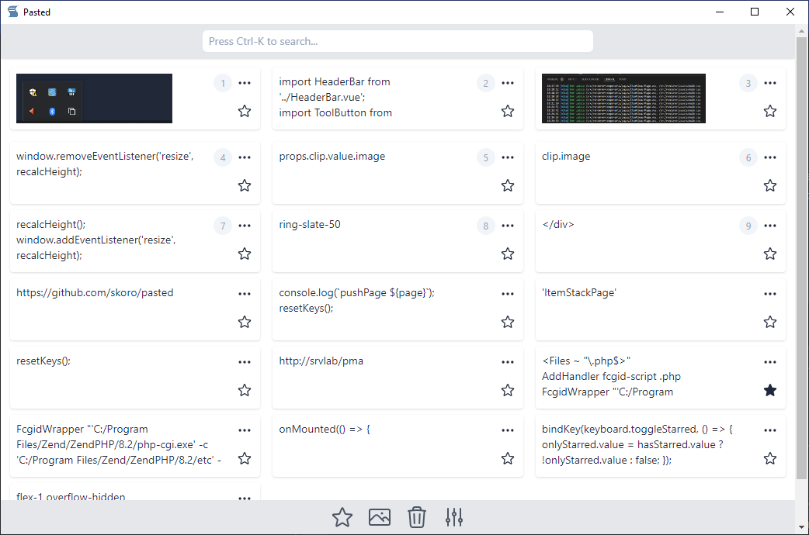

  
<h1 align="center"> Pasted </h1>  

   Yet another clipboard tool.

## Features
* Save history of the system clipboard.
* Allow to persist clipboard items.
* Quick copy of first 9 items by pressing 1..9 keys.
* Create a QR code of the selected text item (limit by text size).
* Preview text and images.
* Responsive by window size: 1, 2, 3, 4 columns.
* Search text items.
* Available for Windows and Linux.

## App

